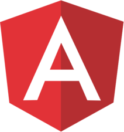

 

# Using Kendo UI for Angular

This Kendo UI for Angular sample project demonstrates how to use [Kendo UI for Angular components](https://www.telerik.com/kendo-angular-ui/components) within a finance prototype application and visualize data. Currently, [the example is deployed on GitHub pages](https://telerik.github.io/kendo-angular/finance-portfolio).

Used Kendo UI for Angular Components:
 - [Grid Component](https://www.telerik.com/kendo-angular-ui/components/grid/)
 - [Charts](https://www.telerik.com/kendo-angular-ui/components/charts/)
 - [DateInputs](https://www.telerik.com/kendo-angular-ui/components/dateinputs/)
 - [DropDonws](https://www.telerik.com/kendo-angular-ui/components/dropdowns/)
 - [Splitter Component](https://www.telerik.com/kendo-angular-ui/components/layout/splitter/)
 - [Buttons](https://www.telerik.com/kendo-angular-ui/components/buttons/button/)
 - [Kendo Theme Bootstrap](https://www.telerik.com/kendo-angular-ui/components/styling/theme-bootstrap/)

## Setting Up the Project

The sample project runs with the [currently supported Angular version](https://www.telerik.com/kendo-angular-ui/components/installation/requirements/#toc-angular).

## Getting Started

1. Clone the repository of the sample application locally by running `git clone https://github.com/telerik/kendo-angular.git`.
1. Navigate to the project folder by running `cd examples-standalone/finance-portfolio`.
1. Install dependencies with NPM by running `npm install`.

## Building for Development

To run the project:
1. Execute the `ng serve` command in the terminal window for a dev server.
1. Navigate to `http://localhost:4200/`. The app will automatically reload if you change any of the source files.